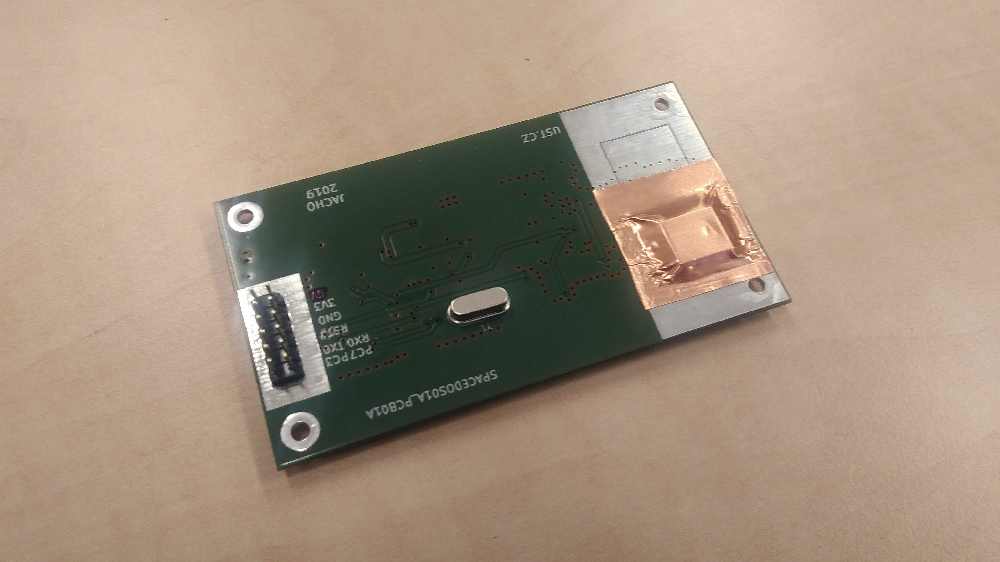

# SPACEDOS01A
It is intended for masurement of cosmic radiation and dosimetry in mixed ionization fields on board satellites. 

The first prototype

**Technical parameters are following:**
* Silicon PIN diode detector with 12.5 mm³ detection volume
* Number of energy channels 250
* Deposited energy range from 200 keV to 12 MeV
* Energy measurement resolution < 50 keV/channel
* Power supply 3.3 V / 3 mA 
* Integration time 15 s
* Interface - RS232 TTL
* H x W  x  L - 15mm x 51mm x 91mm

