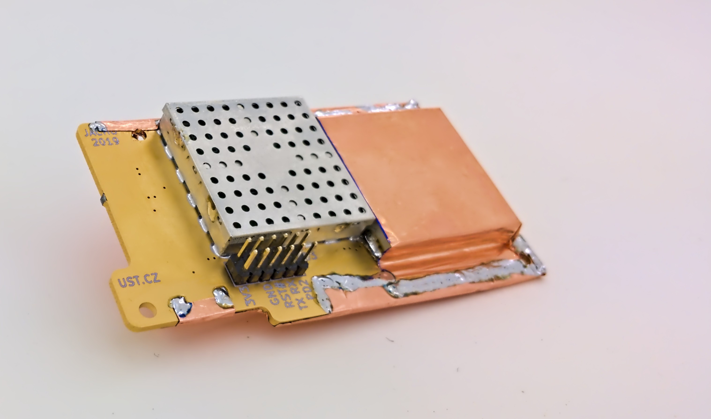
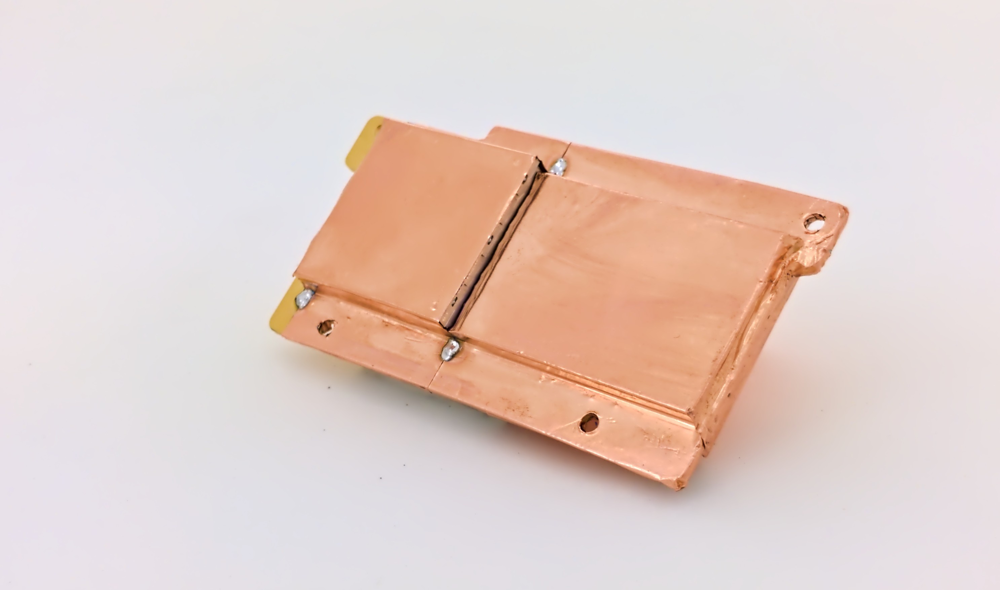

# SPACEDOS01B - Cosmic-ray spectrometer and dosimeter for unmanned spacecraft missions

SPACEDOS01B is a semiconductor-based dosimeter launched at Sokrat-R (NORAD ID 44404) satellite, currently orbiting the Earth about 500km above the surface.
The device is intended for the measurement of cosmic radiation in mixed ionization fields on board satellites. In the case of manned missions look to [SPACEDOS02](https://github.com/UniversalScientificTechnologies/SPACEDOS02) or [SPACEDOS03](https://github.com/UniversalScientificTechnologies/SPACEDOS03).

The device can be purchased from Universal Scientific Technologies s.r.o. Contact us by email at sale@ust.cz for a commercial quotation.

### The main technical parameters are the following

* Silicon PIN diode detector with ~12.5 mm³ detection volume
* Measurement environment: vacuum < 3.2×10e−2 Pa
* Number of energy channels: 250
* Deposited energy range: from 200 keV to 12 MeV
* Energy measurement resolution: < 50 keV/channel
* Power supply: 3.3 V / 3 mA
* Integration time: 15 s
* Interface: RS232 TTL
* Dimensions(HxWxL): 15mm x 41mm x 94 mm
* Weight 33 g

[Technical documentation](https://docs.dos.ust.cz/spacedos/SPACEDOS01)

## References

  * [SPACEDOS dosimeter from the NPI became a part of the Cosmos Discovery exhibition](http://www.ujf.cas.cz/en/news/SPACEDOS-dosimeter-from-the-NPI-became-a-part-of-the-Cosmos-Discovery-exhibition/)
  * [SPACEDOS an open-source PIN diode dosimeter for applications in Space](https://indico.ujf.cas.cz/event/2/contributions/27/attachments/25/46/Po-1315-Kakona-774711333.pdf)
