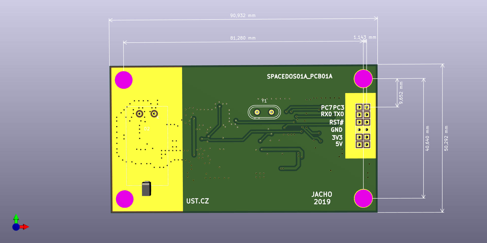
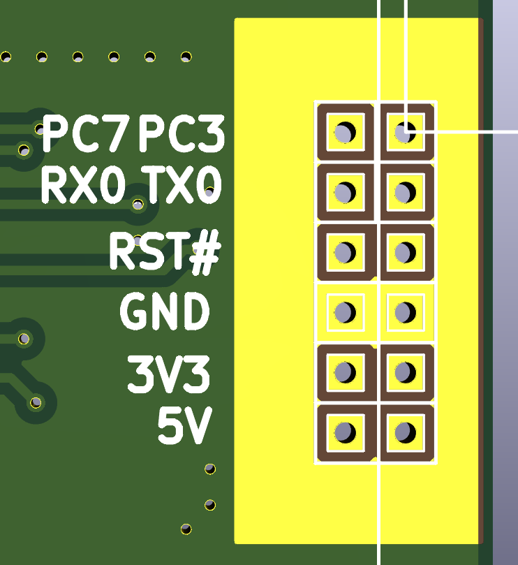

# SPACEDOS
## Physical dimensions


## Energetic range and Climatic endurance

 * Dissipated Energy range: from 200 keV to 9 MeV
 * Energy Resolution: < 50 keV
 * Temperature Stability: from -50 ℃ to +50 ℃ within error +50 keV
 * Used Sensor: HAMAMATSU S11773-02 (PIN diode 5 x 5 x 0.5 mm<sup>3</sup>)

## Electrical interface


Signal | Description
--- | ---
PC7 |  Universal IO pin
PC3 |  Universal IO pin
RX0 |  RS232 Receive (3.3 V)
TX0 |  RS232 Transmit (3.3 V)
RST# | Reset (trough capacitor)
GND |  Ground
3V3 |  Power supply +3.3 V
5V  |  Internally connected to +3.3 V

Power consumption: 2.6 mA from 3.3 V

## Communication protocol
### Sample of output data
```
#Cvak...
#Hmmm...
$DPSD,00000f08,7fc5,002f,0000,0000,0001,0000,0000,0000,0000,0100
$HKSD,244,3848,32778,254,0,0,32709,47,0,0,0,0,0,0,1,0,0,0,0,0,0,0,0,0,0,0,0,0,0,0,0,0,0,0,0,0,0,0,0,0,0,0,0,0,0,0,0,0,0,0,0,0,0,0
$BESD,0004,0000010e,00000000,00000000,00000001,00000000,00000000,00000000,00000000
$ADSD,000000de,00000003,00000000,0000011d,00000000,00000000
```
SPACEDOS sends $DPSD, $HKSD and $BESD messages each cca 15 seconds.
$ADSD message is sended ones per one day.

Communication speed is 2400 baud.

### Power On

`#Cvak…`

This information just says hello after power on.

### Initiation complete

`#Hmmm...`

Initiation of the SPACEDOS HW is done.
Initiation is completed up to one second after power on.

### DPSD - SpaceDos Data Payload message

`
$DPSD, <uptime>, <noise channel>, <0.1 MeV>, <0.14 MeV>, <0.21 MeV>, <0.33 MeV>, <0.66 MeV>, <1.68 MeV>, <4.72 MeV>, <'>=9 MeV'>, <DC offset>`

Value | Length | Type |Note
--- | --- | --- | ---
$DPSD | 5 B | Char | Header
uptime | 4 B | Hex | Time from power on
noise channel | 2 B | Hex | this channel containing noise
0.1 MeV | 2 B | Hex | number of particles with absorbed energy above 0.1 MeV
... | ... | ... |
'>=9' MeV | 2 B | Hex | Overrange particles
DC offset | 2 B | Hex | Offset of ADC

This messages should be stored for long period and transmited to the ground as a batch.

Minimal data payload (without timemark) is 18 B per 15 s => 103680 B per day

### HKSD - SpaceDos HouseKeeping message

`$HKSD, <measurement No.> , <uptime>, <filter suppressions>, <position of the 1-st channel>, <1-st ch.>, <2-nd ch.>, <3-rd ch.>,...` 

There is a packet with housekeeping information. Transmission of this packet is done besides other experiments hosekeeping data. Total length of this packet should be shorten. 

Value | Range | type |Note
--- | --- | --- | ---
$HKSD | fix | Char | Header
measurement No. | 0..65535 | Dec |
uptime | 0..4294967295 | Dec |
filter suppressions | 0..65535 | Dec | Number of ussage of digital filter for double peak suppression
position of the 1-st channel | 0..511 | Dec |
1-st ch. | 0..65535 | Dec | Number of events in 1-st ch.
2-nd ch. | 0..65535 |  Dec |Number of events in 2-nd ch.
... | ... |
50-th ch. | 0..65535 |  Dec |Number of events in 50-th ch.

### BESD - SpaceDos BEacon message

`$BESD,<counter>, <0.1 MeV>, <0.14 MeV>, <0.21 MeV>, <0.33 MeV>, <0.66 MeV>, <1.68 MeV>, <4.72 MeV>, <'>=9 MeV'>`

This message contains cumulative data for beacon transmission.

Value | Length | Type |Note
--- | --- | --- | ---
$BESD | 5 B | Char | Header
counter | 2 B | Hex | Number of the beacon message
0.1 MeV | 2 B | Hex | number of particles with absorbed energy above 0.1 MeV
0.14 MeV | 2 B | Hex | number of particles with absorbed energy above 0.14 MeV
... | ... | ... |
'>=9' MeV | 2 B | Hex | Overrange particles

### ADSD - SpaceDos Almanac Data message

`$ADSD, <0.1 MeV 1 day old>, <0.14 MeV one day old>, <0.66 MeV one day old>, <0.1 MeV two days old>, <0.14 MeV two days old>, <0.66 MeV two days old>`

This message contains two days old data for the beacon transmission purposes.

Value | Length | Type |Note
--- | --- | --- | ---
$ADSD | 5 B | Char | Header
0.1 MeV one day old | 4 B | Hex | number of particles with absorbed energy above 0.1 MeV one day before
0.14 MeV one day old | 4 B | Hex | number of particles with absorbed energy above 0.14 MeV one day before
0.66 MeV one day old | 4 B | Hex | number of particles with absorbed energy above 0.66 MeV one day before
0.1 MeV two days old | 4 B | Hex | number of particles with absorbed energy above 0.1 MeV two days before
0.14 MeV two days old | 4 B | Hex | number of particles with absorbed energy above 0.14 MeV two days before
0.66 MeV two days old | 4 B | Hex | number of particles with absorbed energy above 0.66 MeV two days before

